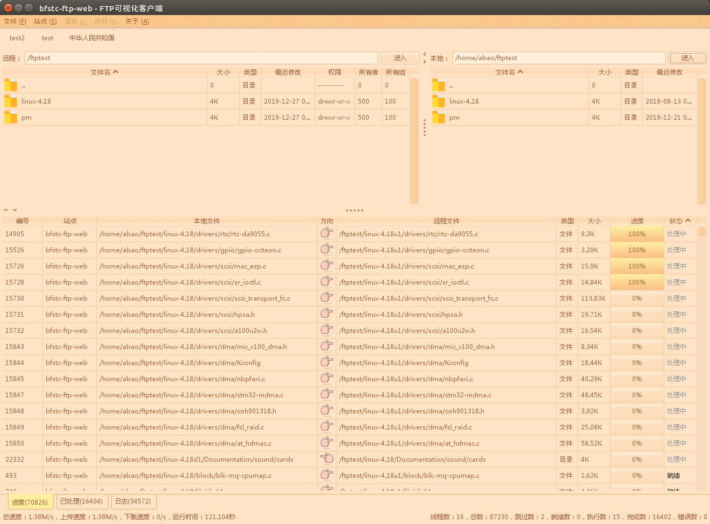

# ftp-gui
FTP client of GUI version implemented by Java(jdk 1.9 version).

### Compile and run
1. add java 1.9 environment variable: export PATH=/opt/java-se-9-ri/jdk-9/bin:$PATH
2. Compile: ./build.sh
3. Run: ./run.sh

### Interface screenshots

